# Gemini를 활용한 네이버 메일 스팸 분석 서비스

**Naver Mail Spam Analysis Service Using Gemini**

Vercel Link :
https://gemini-pr-lux02s-projects.vercel.app/

## 서비스 소개

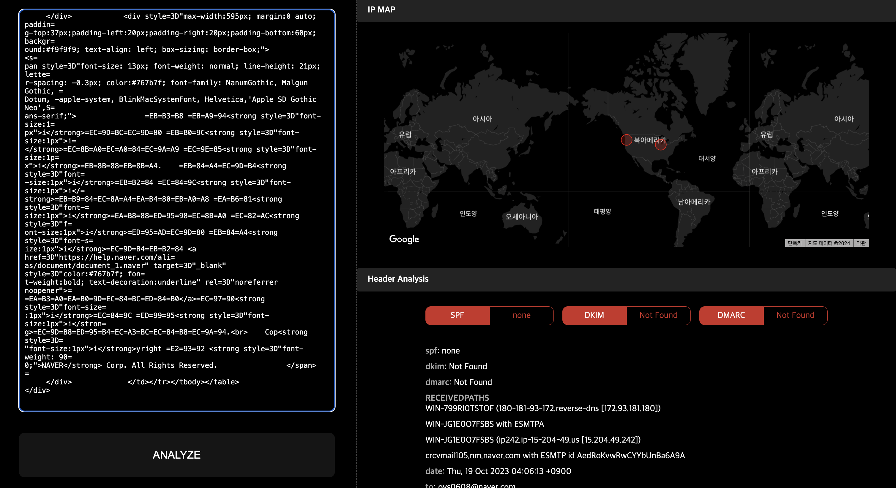
Gemini를 활용한 네이버 메일 스팸 분석 서비스'는 사용자가 수신한 이메일을 자동으로 분석하여 스팸, 피싱, 및 기타 잠재적인 위협 요소를 식별할 수 있도록 돕는 강력한 이메일 보안 서비스입니다. 본 서비스는 메일 원문의 헤더와 본문을 파싱하여 이메일 내 텍스트 및 주요 데이터를 심층적으로 분석하며, Censys API와 Google Gemini API를 활용하여 IP 및 도메인 정보를 바탕으로 높은 정확도로 잠재적인 위험성을 평가합니다.

The 'Naver Mail Spam Analysis Service Using Gemini' is a powerful email security service that helps users automatically analyze received emails to identify spam, phishing, and other potential threats. The service parses the headers and body of the email, analyzing the text and key data within it in depth, and evaluates potential risks with high accuracy based on IP and domain information using the Censys API and Google Gemini API.

네이버 메일은 대한민국 국민 대다수가 사용하는 대표적인 이메일 서비스로, 사용자께서는 메일에 포함된 링크나 첨부파일을 클릭하기 전에, 해당 메일이 피싱 메일인지, 스팸 메일인지 여부를 신속하게 판단할 수 있는 기능을 제공받을 수 있습니다.

Naver Mail is a representative email service used by the majority of South Koreans. Users can quickly determine whether an email is a phishing or spam mail before clicking on any links or attachments.

특히, Google Gmail의 경우 '원본 보기' 기능을 통해 강력한 분석 서비스를 제공하는 반면, 네이버 메일의 경우 이러한 분석 기능이 아직 제공되지 않고 있어 그 필요성을 느끼게 되었습니다. 이에 따라, 사용자가 이메일을 통해 발생할 수 있는 다양한 보안 위협으로부터 보호받을 수 있도록 본 서비스를 설계하게 되었습니다.

While Google Gmail provides a powerful analysis service through the "View Original" feature, Naver Mail currently lacks such analysis capabilities, highlighting the need for it. This service is designed to protect users from various security threats that can arise through email.

# 문제 정의

▶ 스팸 메일 분석을 통한 국가안보 프로젝트

Establishing national security projects through spam mail analysis

▶ 북한발 무차별 스팸 메일 공격 억제 및 피해 축소

Curbing and reducing the damage from indiscriminate spam mail attacks from North Korea

▶ 민간인 피해를 최소화하기 위한 플랫폼 개발 및 공유

Developing and sharing platforms to minimize civilian damage

### 프로젝트 의의 및 기대효과

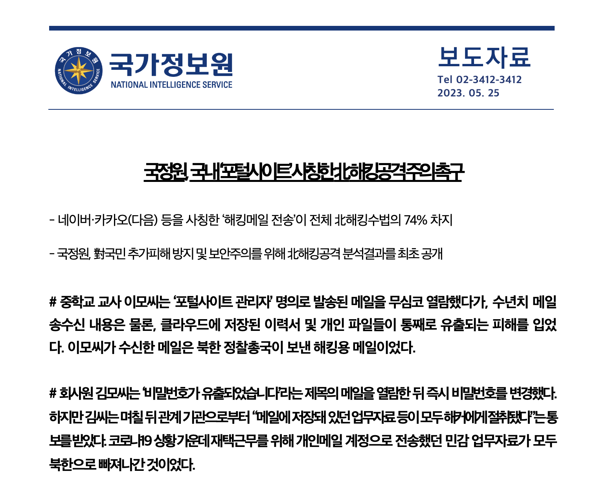

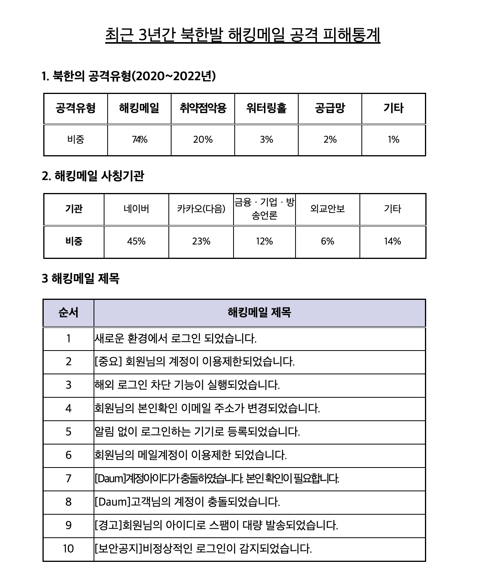
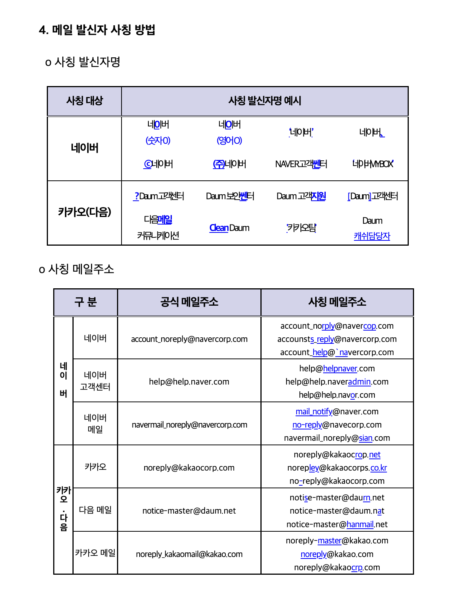

출처: 국가정보원 보도자료(230535) - ‘국정원, 국내 '포털사이트' 사칭한 北 해킹공격주의 촉구’

국가정보원이 지난 5월 25일에 공개한 ‘최근 3년간 북한 해킹조직의 사이버 공격 및 피해통계’에 대한 보도자료를 보면, 네이버, 카카오(다음) 등을 사칭한 해킹 메일 공격이 전체 해킹 수법의 74%를 차지하며 압도적으로 높은 것을 볼 수 있다. 이는 대한민국 국민 전체를 대상으로 한 무분별한 불특정 사이버 공격이 자행되고 있으며, 메일 주소 및 내용을 네이버를 포함한 포털사이트, 국가기관, 단체, 개인 등으로 비슷하게 사칭하여 수신자의 계정 정보를 탈취하기 위한 사회심리공학 기법 등 매년 고도화된 공격 기법이 사용되고 있다. 문제는 대부분의 사람들이 피싱 메일에 대해 안일하게 생각하고 있으며, 공격자들은 목적을 달성할 때까지 굉장히 정교한 시나리오를 가지고 접근하며 공격 피해사실을 바로 알 수 없기 때문에 6개월, 1년이 지나서야 수사기관(국가정보원, 검찰청, 경찰청)의 조사로 알게 되는 상황이다.

According to a press release from the National Intelligence Service on May 25th, 74% of all hacking methods involved phishing emails posing as Naver, Kakao (Daum), etc. This indicates that indiscriminate cyberattacks targeting the entire South Korean population are being carried out, using highly sophisticated social engineering techniques to impersonate portals, government agencies, organizations, and individuals to steal account information. The problem is that most people are complacent about phishing emails, and attackers approach with a highly elaborate scenario until they achieve their goals, so victims often don't realize they've been attacked until six months or a year later when an investigation by the authorities (National Intelligence Service, Prosecutor's Office, Police Agency) reveals the truth.

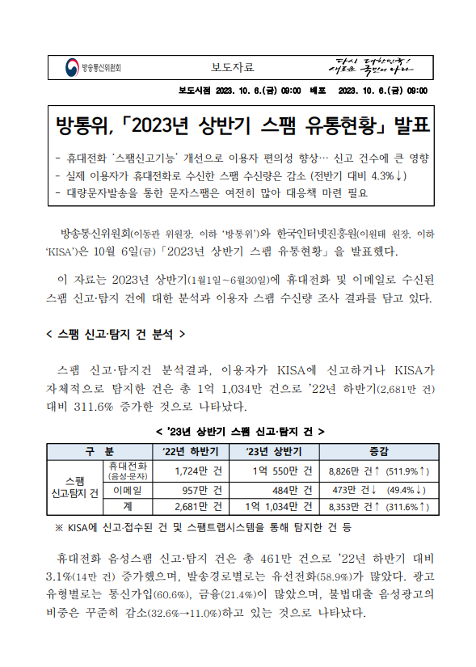
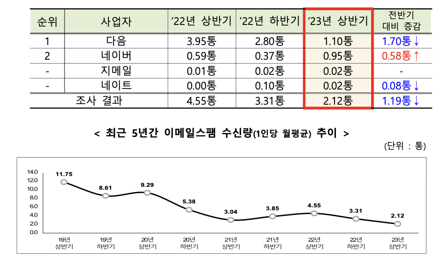

출처: 방송통신위원회 ‘2023년 상반기 스팸 유통현황’

작년 10월 6일, 방송통신위원회와 한국인터넷진흥원에서 발표한 ‘2023년 상반기 스팸 유통현황’에 따르면, 2023년 상반기(1월1일~6월30일) 스팸 신고 및 탐지 분석 결과, 총 1억 1,034만 건으로 2022년 하반기 대비 311.6%로 대폭 증가하였으며, 이메일 스팸 수신량은 49.4% 감소하였지만 **네이버 메일의 경우 스팸 수신량이 0.58통 증가하였다.**

According to the "2023 First Half Spam Distribution Report" released by the Korea Communications Commission and the Korea Internet & Security Agency on October 6th, 2023, the total number of spam reports and detection analyses for the first half of 2023 (January 1st to June 30th) increased by 311.6% compared to the second half of 2022, with a total of 110.34 million cases. Although the volume of email spam received decreased by 49.4%, the volume of spam received on Naver Mail increased by 0.58 emails.

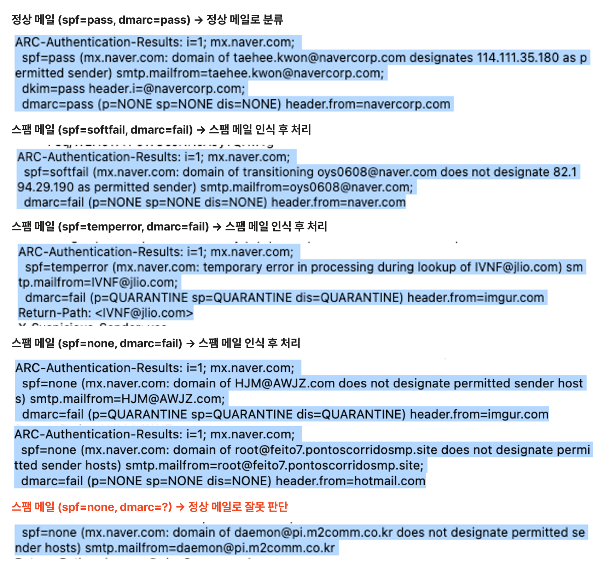

특히 국내 사용자가 많은 네이버 메일에서 스팸 필터링에 대한 취약점을 발견할 수 있었다.

In particular, vulnerabilities in spam filtering were found on Naver Mail, which has a large number of domestic users.

현재 네이버 메일 시스템은 SPF, DKIM, DMARC와 같은 메일 인증 프로토콜을 활용하여 스팸과 피싱 메일을 필터링한다. 그러나 SPF 결과가 'none'으로 확인될 경우, 추가적인 인증 절차를 거치지 않아도 스팸 메일이 사용자에게 그대로 전달되는 문제로 인해 사이버 공격으로부터 많은 피해가 발생하고 있는 것을 파악하였다.

Naver's current email system uses email authentication protocols such as SPF, DKIM, and DMARC to filter spam and phishing emails. However, it was found that when the SPF result is 'none', spam emails are delivered to users without any additional authentication, causing significant damage from cyberattacks.

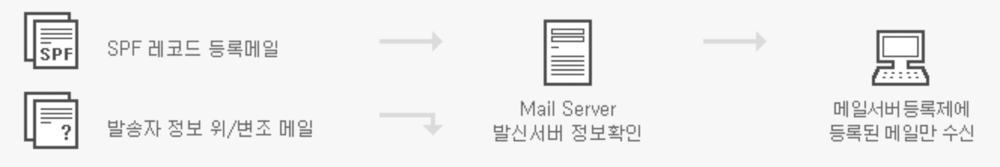

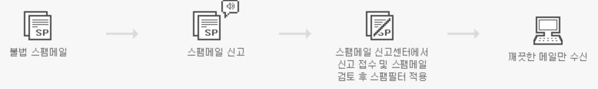

출처 : 네이버 약관 및 개인정보 보호 - 네이버 스팸메일 방지정책

네이버의 스팸메일 차단 시스템은 Head From을 기준으로 메일서버등록제(SPF), DKIM 서명 도메인 등의 기준으로 발송자 신뢰도를 판단하고 있다. 그리고 스팸신고제를 실시하여 수신자의 스팸 신고를 통해 메일 내용 및 신고 건수를 분석하여 메일 서버에서 해당 메일이 수신되지 않도록 차단하고 있다.

Naver's spam mail blocking system determines the sender's reliability based on criteria such as the mail server registration system (SPF) and DKIM signed domains, using the "Head From" field. It also implements a spam reporting system, where reports from recipients are analyzed to block the corresponding email from being received by the mail server.

하지만 앞서 보았듯이 SPF가 ‘None’일 경우 이러한 필터링 시스템은 제대로 동작하지 않기 때문에, 보다 정교한 이메일 분석 시스템을 구축하여 기존 메일 인증 시스템의 취약점을 보완하고, 사용자들을 사이버 위협으로부터 더 효과적으로 보호할 수 있는 가능성을 제시한다. 이번 서비스를 통해 사이버 공격으로 인한 피해를 최소화하여 국가안보에 크게 기여할 것으로 기대된다.

However, as seen earlier, when SPF is 'None', this filtering system does not function properly, highlighting the need for a more sophisticated email analysis system to complement the vulnerabilities of the existing email authentication system and more effectively protect users from cyber threats. This service is expected to contribute significantly to national security by minimizing the damage caused by cyberattacks.

# 주요 기능

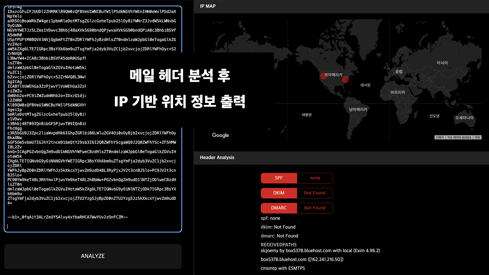
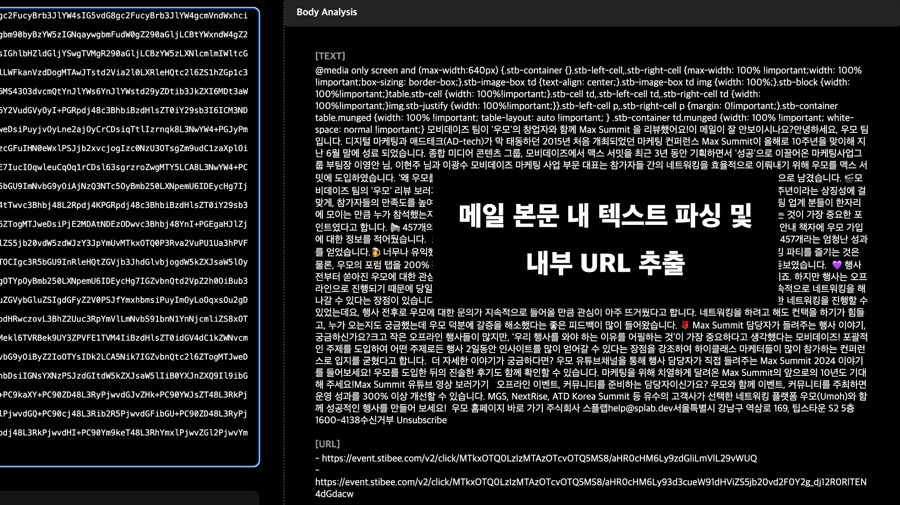
Analyzes the IP and domain of emails received by users through the Censys API to assess the likelihood of the email being spam or phishing.

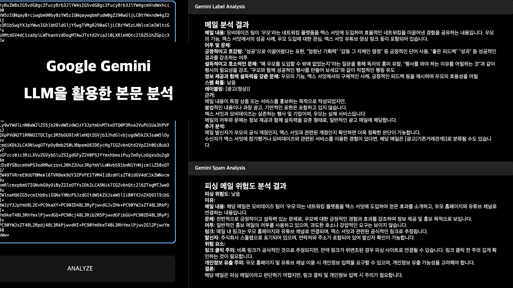
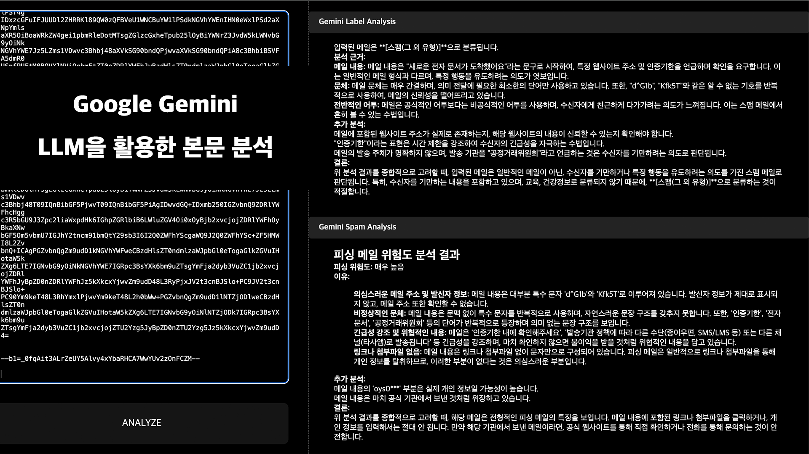
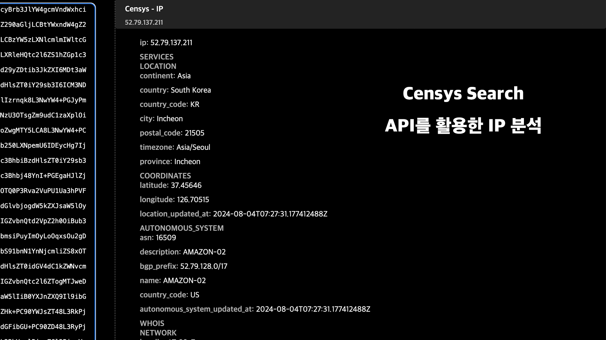

Analyzes the email body using the Google Gemini API and classifies it into spam, phishing, malware, etc.

# Gemini 프롬프트

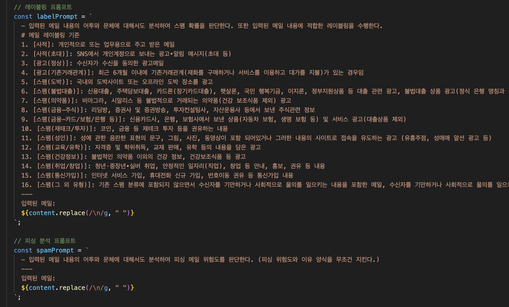
방송통신위원회에서 지정한 이메일 스팸 분류표를 프롬프트에 적용하여 해당 메일에 대한 레이블링을 수행하도록 하였습니다.

We applied the email spam classification table designated by the Korea Communications Commission to the prompt to label the email accordingly.
