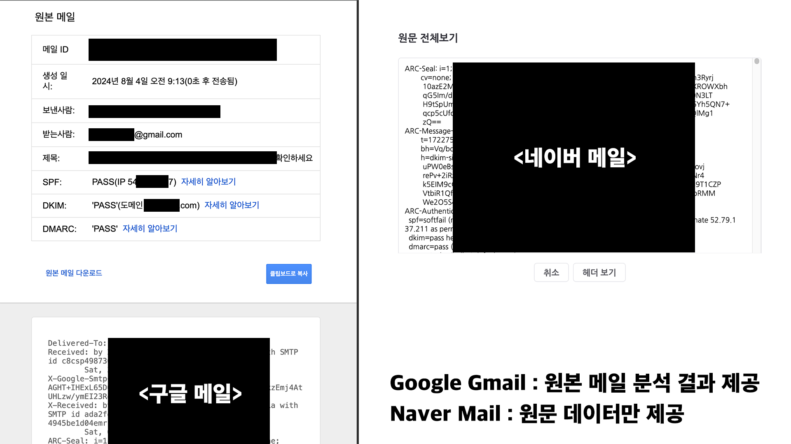

# Gemini를 활용한 네이버 메일 스팸 분석 서비스

## 서비스 소개

Gemini를 활용한 네이버 메일 스팸 분석 서비스'는 사용자가 수신한 이메일을 자동으로 분석하여 스팸, 피싱, 및 기타 잠재적인 위협 요소를 식별할 수 있도록 돕는 강력한 이메일 보안 서비스입니다. 본 서비스는 메일 원문의 헤더와 본문을 파싱하여 이메일 내 텍스트 및 주요 데이터를 심층적으로 분석하며, Censys API와 Google Gemini API를 활용하여 IP 및 도메인 정보를 바탕으로 높은 정확도로 잠재적인 위험성을 평가합니다.

네이버 메일은 대한민국 국민 대다수가 사용하는 대표적인 이메일 서비스로, 사용자께서는 메일에 포함된 링크나 첨부파일을 클릭하기 전에, 해당 메일이 피싱 메일인지, 스팸 메일인지 여부를 신속하게 판단할 수 있는 기능을 제공받을 수 있습니다.

특히, Google Gmail의 경우 '원본 보기' 기능을 통해 강력한 분석 서비스를 제공하는 반면, 네이버 메일의 경우 이러한 분석 기능이 아직 제공되지 않고 있어 그 필요성을 느끼게 되었습니다. 이에 따라, 사용자가 이메일을 통해 발생할 수 있는 다양한 보안 위협으로부터 보호받을 수 있도록 본 서비스를 설계하게 되었습니다.
